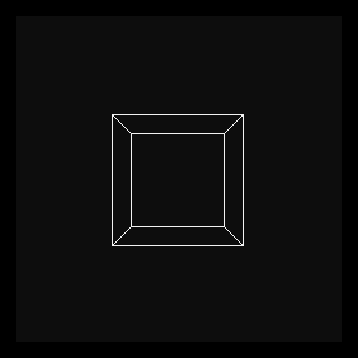

# Frame-transition animation

I saw this video on YouTube about a POV-illusion and I thought it would be cool to try to recreate it in Julia. The original video can be found at the following link: https://www.youtube.com/watch?v=TdTMeNXCnTs.

Bellow is a quick demonstration of the final result. The code to generate the animation is in the file `Main.jl`.

### Final result
**No effect**

**With effect**
